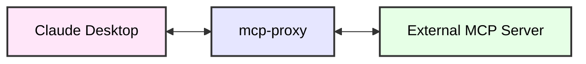

# mcp-proxy

- [mcp-proxy](#mcp-proxy)
  - [About](#about)
  - [Installation](#installation)
  - [Configuration](#configuration)
    - [Claude Desktop Configuration](#claude-desktop-configuration)
  - [Advanced Configuration](#advanced-configuration)
    - [Environment Variables](#environment-variables)

## About

Connect to MCP servers that run on SSE transport using the MCP Proxy server.



> [!TIP]
> As of now, Claude Desktop does not support MCP servers that run on SSE transport. This server is a workaround to enable the support.

## Installation

```bash
uv tool install git+https://github.com/sparfenyuk/mcp-proxy
```

> [!NOTE]
> If you have already installed the server, you can update it using `uv tool upgrade --reinstall` command.

> [!NOTE]
> If you want to delete the server, use the `uv tool uninstall mcp-proxy` command.

## Configuration

### Claude Desktop Configuration

Configure Claude Desktop to recognize the MCP server.

1. Open the Claude Desktop configuration file:
   - in MacOS, the configuration file is located at `~/Library/Application Support/Claude/claude_desktop_config.json`
   - in Windows, the configuration file is located at `%APPDATA%\Claude\claude_desktop_config.json`

   > __Note:__
   > You can also find claude_desktop_config.json inside the settings of Claude Desktop app

2. Add the server configuration

    ```json
    {
      "mcpServers": {
        "mcp-proxy": {
            "command": "mcp-proxy",
            "env": {
              "SSE_URL": "http://example.io/sse"
            }
        }
      }
    }

    ```

## Advanced Configuration

### Environment Variables

| Name             | Description                                                                        |
| ---------------- | ---------------------------------------------------------------------------------- |
| SSE_URL          | The MCP server SSE endpoint to connect to e.g. http://example.io/sse               |
| API_ACCESS_TOKEN | Added in the `Authorization` header of the HTTP request as a `Bearer` access token |
