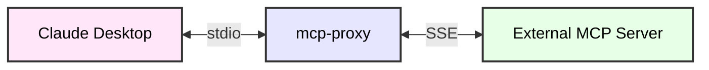
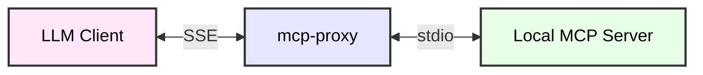

# mcp-proxy


[](https://codecov.io/gh/sparfenyuk/mcp-proxy)
[](https://smithery.ai/server/mcp-proxy)

- [mcp-proxy](#mcp-proxy)
  - [About](#about)
  - [1. stdio to SSE](#1-stdio-to-sse)
    - [1.1 Configuration](#11-configuration)
    - [1.2 Example usage](#12-example-usage)
  - [2. SSE to stdio](#2-sse-to-stdio)
    - [2.1 Configuration](#21-configuration)
    - [2.2 Example usage](#22-example-usage)
  - [Installation](#installation)
    - [Installing via Smithery](#installing-via-smithery)
  - [Command line arguments](#command-line-arguments)
  - [Testing](#testing)

## About

The `mcp-proxy` is a tool that lets you switch between server transports. There are two supported modes:

1. stdio to SSE
2. SSE to stdio

## 1. stdio to SSE

Run a proxy server from stdio that connects to a remote SSE server.

This mode allows clients like Claude Desktop to communicate to a remote server over SSE even though it is not supported natively.



### 1.1 Configuration

This mode requires passing the URL to the MCP Server SSE endpoint as the first argument to the program.

Arguments

| Name                 | Required | Description                                                           | Example               |
| -------------------- | -------- | --------------------------------------------------------------------- | --------------------- |
| `command_or_url`     | Yes      | The MCP server SSE endpoint to connect to                             | http://example.io/sse |
| `--api-access-token` | No       | Will be sent as a `Bearer` access token in the `Authorization` header | YOUR_TOKEN            |

Environment Variables

| Name               | Required | Description                                 | Example    |
| ------------------ | -------- | ------------------------------------------- | ---------- |
| `API_ACCESS_TOKEN` | No       | Can be used instead of `--api-access-token` | YOUR_TOKEN |

### 1.2 Example usage

`mcp-proxy` is supposed to be started by the MCP Client, so the configuration must be done accordingly.

For Claude Desktop, the configuration entry can look like this:

```json
{
  "mcpServers": {
    "mcp-proxy": {
        "command": "mcp-proxy",
        "args": ["http://example.io/sse"],
        "env": {
          "API_ACCESS_TOKEN": "access-token"
        }
    }
  }
}
```

## 2. SSE to stdio

Run a proxy server exposing a SSE server that connects to a local stdio server.

This allows remote connections to the local stdio server. The `mcp-proxy` opens a port to listen for SSE requests, spawns a local stdio server that handles MCP requests.



### 2.1 Configuration

This mode requires the `--sse-port` argument to be set. The `--sse-host` argument can be set to specify the host IP address that the SSE server will listen on. Additional environment variables can be passed to the local stdio server using the `--env` argument. The command line arguments for the local stdio server must be passed after the `--` separator.

Arguments

| Name             | Required                   | Description                                                      | Example              |
| ---------------- | -------------------------- | ---------------------------------------------------------------- | -------------------- |
| `command_or_url` | Yes                        | The command to spawn the MCP stdio server                        | uvx mcp-server-fetch |
| `--sse-port`     | No, random available       | The SSE server port to listen on                                 | 8080                 |
| `--sse-host`     | No, `127.0.0.1` by default | The host IP address that the SSE server will listen on           | 0.0.0.0              |
| `--env`          | No                         | Additional environment variables to pass to the MCP stdio server | FOO=BAR              |

### 2.2 Example usage

To start the `mcp-proxy` server that listens on port 8080 and connects to the local MCP server:

```bash
# Start the MCP server behind the proxy
mcp-proxy uvx mcp-server-fetch

# Start the MCP server behind the proxy with a custom port
mcp-proxy --sse-port=8080 uvx mcp-server-fetch

# Start the MCP server behind the proxy with a custom host and port
mcp-proxy --sse-host=0.0.0.0 --sse-port=8080 uvx mcp-server-fetch

# Start the MCP server behind the proxy with a custom user agent
# Note that the `--` separator is used to separate the `mcp-proxy` arguments from the `mcp-server-fetch` arguments
mcp-proxy --sse-port=8080 -- uvx mcp-server-fetch --user-agent=YourUserAgent
```

This will start an MCP server that can be connected to at `http://127.0.0.1:8080/sse`

## Installation

### Installing via Smithery

To install MCP Proxy for Claude Desktop automatically via [Smithery](https://smithery.ai/server/mcp-proxy):

```bash
npx -y @smithery/cli install mcp-proxy --client claude
```

The stable version of the package is available on the PyPI repository. You can install it using the following command:

```bash
# Option 1: With uv (recommended)
uv tool install mcp-proxy

# Option 2: With pipx (alternative)
pipx install mcp-proxy
```

Once installed, you can run the server using the `mcp-proxy` command. See configuration options for each mode above.

The latest version of the package can be installed from the git repository using the following command:

```bash
uv tool install git+https://github.com/sparfenyuk/mcp-proxy
```

> [!NOTE]
> If you have already installed the server, you can update it using `uv tool upgrade --reinstall` command.

> [!NOTE]
> If you want to delete the server, use the `uv tool uninstall mcp-proxy` command.

## Command line arguments

```bash
usage: mcp-proxy [-h] [--api-access-token API_ACCESS_TOKEN] [-e KEY VALUE] [--sse-port SSE_PORT] [--sse-host SSE_HOST] [command_or_url] [args ...]

Start the MCP proxy in one of two possible modes: as a SSE or stdio client.

positional arguments:
  command_or_url        Command or URL to connect to. When a URL, will run a SSE client, otherwise will run the given command and connect as a stdio client. See corresponding options for more details.

options:
  -h, --help            show this help message and exit

SSE client options:
  --api-access-token API_ACCESS_TOKEN
                        Access token Authorization header passed by the client to the SSE server. Can also be set as environment variable API_ACCESS_TOKEN.

stdio client options:
  args                  Any extra arguments to the command to spawn the server
  -e KEY VALUE, --env KEY VALUE
                        Environment variables used when spawning the server. Can be used multiple times.

SSE server options:
  --sse-port SSE_PORT   Port to expose a SSE server on. Default is a random port
  --sse-host SSE_HOST   Host to expose a SSE server on. Default is 127.0.0.1

Examples:
  mcp-proxy http://localhost:8080/sse
  mcp-proxy --api-access-token YOUR_TOKEN http://localhost:8080/sse
  mcp-proxy --sse-port 8080 -- your-command --arg1 value1 --arg2 value2
  mcp-proxy your-command --sse-port 8080 -e KEY VALUE -e ANOTHER_KEY ANOTHER_VALUE
```

## Testing

Check the `mcp-proxy` server by running it with the `mcp-server-fetch` server. You can use the [inspector tool](https://modelcontextprotocol.io/docs/tools/inspector) to test the target server.

```bash
# Run the stdio server called mcp-server-fetch behind the proxy over SSE
mcp-proxy --sse-port=8080 uvx mcp-server-fetch &

# Connect to the SSE proxy server spawned above using another instance of mcp-proxy given the URL of the SSE server
mcp-proxy http://localhost:8080/sse

# Send CTRL+C to stop the second server

# Bring the first server to the foreground
fg

# Send CTRL+C to stop the first server
```
