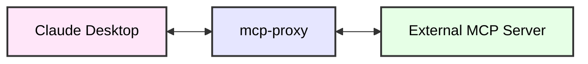
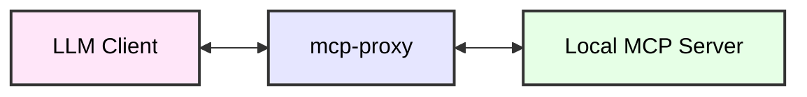

# mcp-proxy

- [mcp-proxy](#mcp-proxy)
  - [About](#about)
  - [Installation](#installation)
  - [Configuration](#configuration)
    - [Claude Desktop Configuration](#claude-desktop-configuration)
  - [Advanced Configuration](#advanced-configuration)
    - [Environment Variables](#environment-variables)

## About

Connect to MCP servers that run on SSE transport, or expose stdio servers as an SSE server using the MCP Proxy server.

## stdio to SSE



> [!TIP]
> As of now, Claude Desktop does not support MCP servers that run on SSE transport. This server is a workaround to enable the support.

## SSE to stdio




## Installation

The stable version of the package is available on the PyPI repository. You can install it using the following command:

```bash
uv tool install mcp-proxy
```

The latest version of the package can be installed from the git repository using the following command:

```bash
uv tool install git+https://github.com/sparfenyuk/mcp-proxy
```

> [!NOTE]
> If you have already installed the server, you can update it using `uv tool upgrade --reinstall` command.

> [!NOTE]
> If you want to delete the server, use the `uv tool uninstall mcp-proxy` command.

## Configuration

### Claude Desktop Configuration

Configure Claude Desktop to recognize the MCP server.

1. Open the Claude Desktop configuration file:
   - in MacOS, the configuration file is located at `~/Library/Application Support/Claude/claude_desktop_config.json`
   - in Windows, the configuration file is located at `%APPDATA%\Claude\claude_desktop_config.json`

   > __Note:__
   > You can also find claude_desktop_config.json inside the settings of Claude Desktop app

2. Add the server configuration

```json
{
  "mcpServers": {
    "mcp-proxy": {
        "command": "mcp-proxy",
        "env": {
          "SSE_URL": "http://example.io/sse"
        }
    }
  }
}

```

## Detailed Configuration

The MCP Proxy server can support two different approaches for proxying:
- stdio to SSE: To allow clients like Claude Desktop to run this proxy directly. The proxy is started by the LLM Client as a server that proxies to a remote server over SSE.
- SSE to stdio: To allow a client that supports remote SSE servers to access a local stdio server. This proxy opens
a port to listen for SSE requests, then spawns a local stdio server that handles MCP requests.

### stdio to SSE

Run a proxy server from stdio that connects to a remote SSE server.

Arguments

| Name               | Description                                                                        |
| ------------------ | ---------------------------------------------------------------------------------- |
| `--sse-url` | Required. The MCP server SSE endpoint to connect to e.g. http://example.io/sse same as environment variable `SSE_URL` |

Environment Variables

| Name             | Description                                                                        |
| ---------------- | ---------------------------------------------------------------------------------- |
| `SSE_URL`          | The MCP server SSE endpoint to connect to e.g. http://example.io/sse same as `--sse-url` |
| `API_ACCESS_TOKEN` | Added in the `Authorization` header of the HTTP request as a `Bearer` access token |


Example usage:

```bash
uv run mcp-proxy --sse-url=http://example.io/sse
```


### SSE to stdio

Run a proxy server exposing an SSE server that connects to a local stdio server. This allows remote connections to the stdio server.

Arguments

| Name               | Description                                                                        |
| ------------------ | ---------------------------------------------------------------------------------- |
| `--sse-port`       | Required. The SSE server port to listen to e.g. `8080` |
| `--sse-host`       | Optional. The host IP address that the SSE server will listen on e.g. `0.0.0.0`. By default only listens on localhost. |
| command            | Required. The path for the MCP stdio server command line. |
| arg1 arg2 ...      | Optional. Additional arguments to the MCP stdio server command line program. |

Example usage:

```bash
uv run mcp-proxy --sse-port=8080 -e FOO=BAR -- /path/to/command arg1 arg2
```

This will start an MCP server that can be connected to at `http://127.0.0.1:8080/sse`
